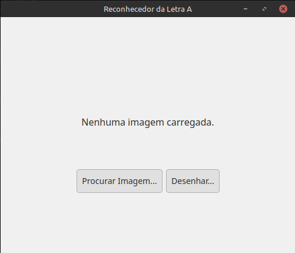
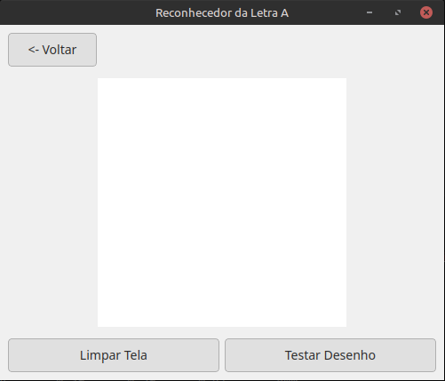
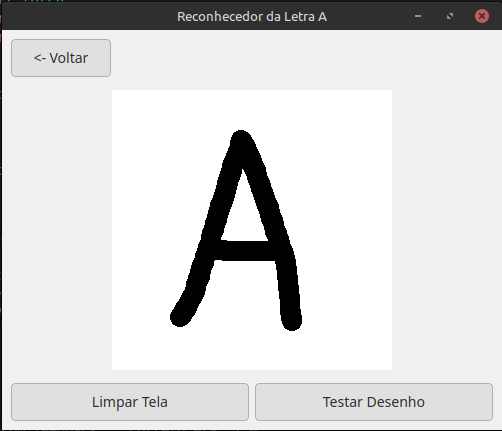
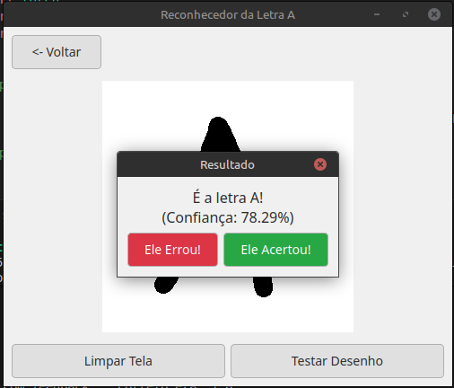

# Perceptron-Reconhecedor
 Desenvolvimento de um Perceptron que classifica uma determinada letra como "A" ou "Não A"

## Tela inicial do programa

## Tela para desenho, ainda em branco

## Exemplo de desenho feito com o mouse

## Resultado da classificação do desenho pelo modelo ja treinado

